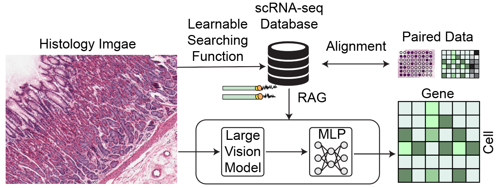

# RAG-ST: Retrieval-Augmented Generation for Spatial Transcriptomics



[](https://www.python.org/downloads/)
[](https://pytorch.org/)
[](https://opensource.org/licenses/MIT)

A novel framework that predicts spatial gene expression from histology images using retrieval-augmented generation, bridging the gap between affordable histology imaging and expensive spatial transcriptomics.

## 🧬 Overview

Spatial transcriptomics provides unprecedented insight into tissue organization but remains costly and technically complex. RAG-ST addresses this by:

- **Predicting gene expression** from readily available histology images
- **Leveraging biological priors** from single-cell RNA-seq databases
- **Providing interpretable results** through retrieval-based generation
- **Enabling scalable deployment** across diverse tissue types

## 🏗️ Architecture

RAG-ST employs a two-stage approach:

1. **Image-to-Cell Type Mapping**: Vision encoders predict cell type distributions from histology patches
2. **Retrieval-Augmented Generation**: Retrieved scRNA-seq profiles guide gene expression prediction

```
Histology Image → Vision Encoder → Cell Type Probabilities → Retrieval Module → Generator → Gene Expression
                                       ↑
                                scRNA-seq Database
```

## 📊 Datasets

- **HEST-1K**: Paired histology images and spatial transcriptomics data
- **CellxGene Census**: Single-cell RNA-seq reference database for biological priors
- **Custom preprocessing pipeline** for multi-modal data integration

## 🚀 Quick Start

### Installation

```bash
git clone https://github.com/yourusername/rag-st.git
cd rag-st
pip install -e .
```

### Data Preparation

```bash
# Download HEST-1K dataset
python scripts/download_hest.py --output_dir data/hest

# Prepare CellxGene references
python scripts/prepare_cellxgene.py --tissue_types liver,brain,lung
```

### Training

```bash
# Stage 1: Train cell type classifier
python train.py --config configs/stage1_celltype.yaml

# Stage 2: Train RAG generator
python train.py --config configs/stage2_rag.yaml
```

### Inference

```python
from ragst import RAGSTModel

model = RAGSTModel.load_pretrained('checkpoints/ragst_best.pth')
gene_expression = model.predict(histology_image)
```

## 📁 Repository Structure

```
rag-st/
├── ragst/                  # Core package
│   ├── models/            # Model architectures
│   ├── data/              # Data loading and preprocessing
│   ├── training/          # Training loops and utilities
│   └── evaluation/        # Metrics and visualization
├── configs/               # Configuration files
├── scripts/               # Data preparation and utilities
├── notebooks/             # Jupyter notebooks for analysis
├── tests/                 # Unit tests
└── docs/                  # Documentation
```

## 🔬 Model Components

### Vision Encoders
- ResNet50/ViT backbones with ImageNet pretraining
- Task-specific fine-tuning for histology domain adaptation
- Multi-scale feature extraction for tissue context

### Retrieval Module
- FAISS-based efficient similarity search
- Embedding-based cell type matching
- Top-k retrieval with biological constraints

### Generator Networks
- Transformer decoder architecture
- Cross-attention between image and scRNA-seq features
- Conditional VAE for probabilistic generation

## 📈 Evaluation

### Quantitative Metrics
- Pearson/Spearman correlation with ground truth
- Mean squared error (MSE) and mean absolute error (MAE)
- Gene-specific and pathway-level accuracy

### Qualitative Analysis
- Spatial gene expression map visualization
- Attention mechanism interpretability
- Biological pathway enrichment analysis

## 🎯 Expected Outcomes

- **Novel architecture** combining computer vision and computational biology
- **Comprehensive benchmark** on spatial transcriptomics prediction
- **Open-source toolkit** for the research community
- **Reduced experimental costs** for spatial biology studies

## 🤝 Contributing

We welcome contributions! Please see [CONTRIBUTING.md](CONTRIBUTING.md) for guidelines.

### Development Setup

```bash
# Create development environment
conda create -n ragst python=3.9
conda activate ragst
pip install -e ".[dev]"

# Run tests
pytest tests/

# Code formatting
black ragst/
isort ragst/
```

## 📚 Citation

```bibtex
@article{zou2025ragst,
  title={RAG-ST: Retrieval-Augmented Generation for Spatial Transcriptomics},
  author={Zou, Zeyu},
  journal={bioRxiv},
  year={2025}
}
```

## 📄 License

This project is licensed under the MIT License - see [LICENSE](LICENSE) file for details.

## 🙏 Acknowledgments

- HEST-1K dataset contributors
- CellxGene Census team
- UC OSPO and GSoC program

---

**Note**: This is an active research project under development. Some features may be experimental or subject to change.